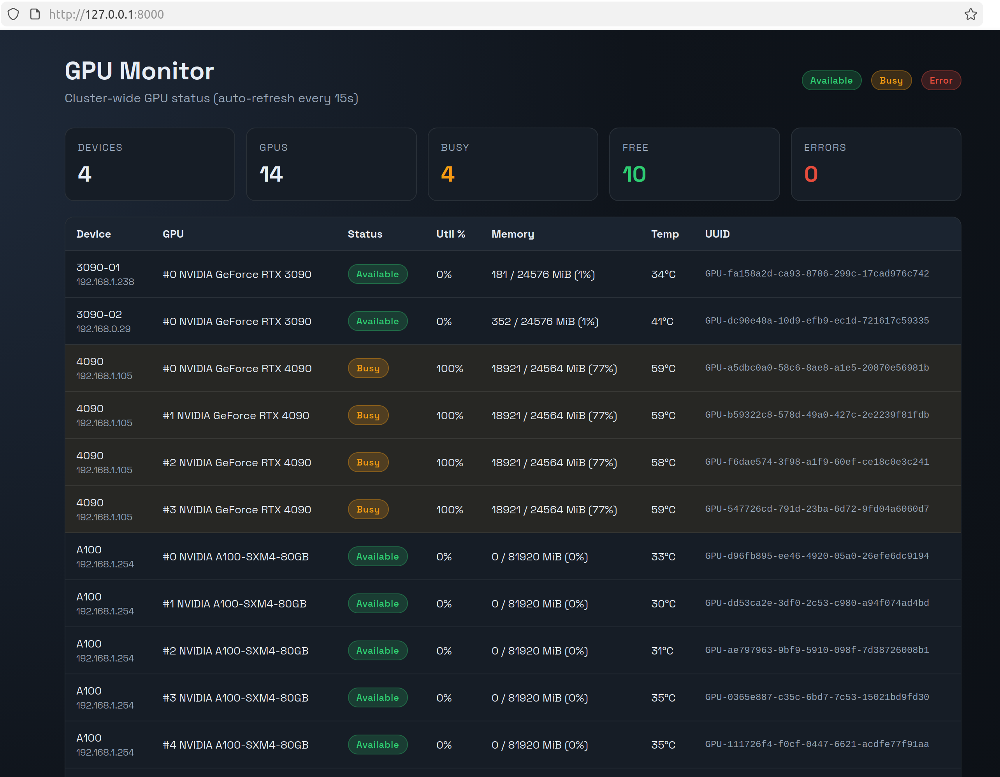

# GPU Monitor

Simple Flask + SSH-based GPU status dashboard. It connects to each host over SSH, runs `nvidia-smi`, and presents a live table of GPU usage.

## Visualization

Below is an example view of the dashboard, showing each device, GPU utilization, memory usage, temperature, and UUID in a single table.



## Setup

1. Create a virtualenv and install deps:

```bash
python3 -m venv .venv
. .venv/bin/activate
pip install -r requirements.txt
```

2. Edit `config.yaml` and set your device list.

- Prefer SSH keys via `auth.key_path`.
- If you must use passwords, set them as environment variables referenced by `auth.password_env`.

Example:

```bash
export GPU_MON_PASS_DGX='your_password'
```

3. Run the server:

```bash
python app.py
```

Open `http://localhost:8000`.

## Notes

- Busy detection is based on thresholds in `config.yaml`:
  - `busy_memory_pct` (default 80)
  - `busy_util_pct` (default 70)
- If a host is unreachable or `nvidia-smi` fails, the UI will show an error row for that device.

## CodeX
codex resume 019c46d1-64a7-7840-bce1-781d3fcfc1bc# GPUs_Monitor
